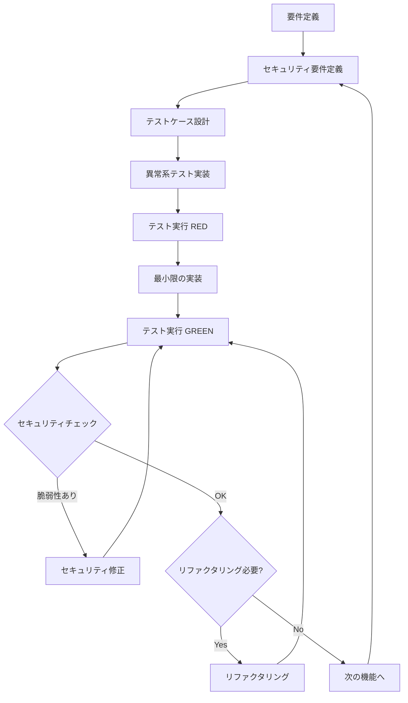
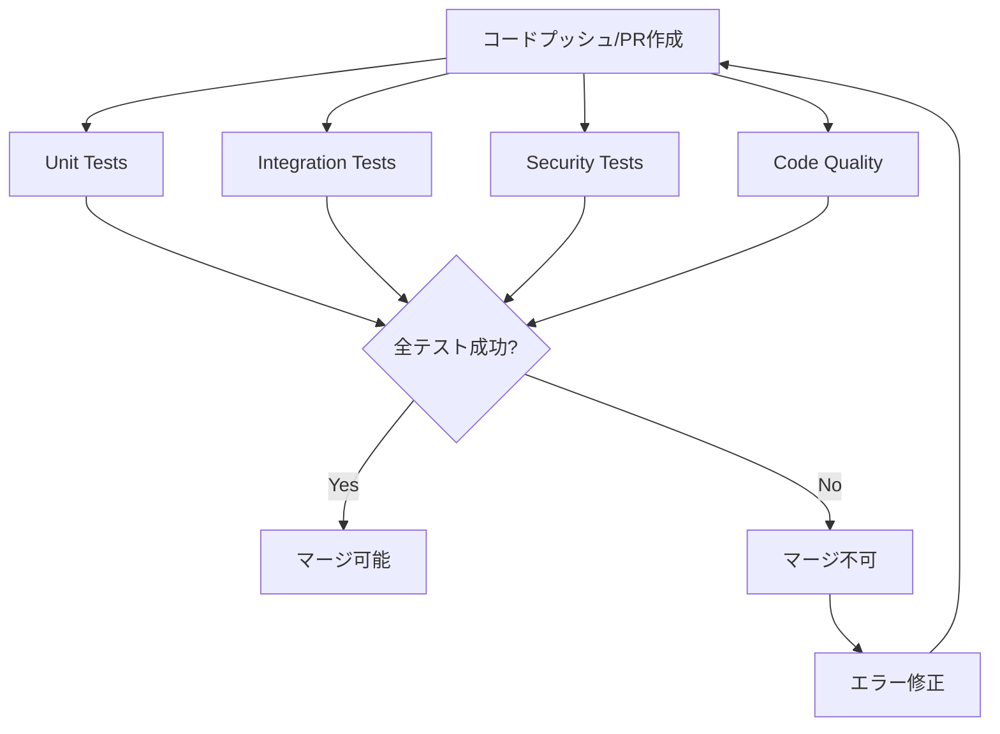

# Phase 2 実装仕様書

**プロジェクト**: LlmMultiChat3  
**フェーズ**: Phase 2 - セキュリティ・品質向上  
**期間**: Week 5-8  
**完了日**: 2025-11-13  
**Git Commit**: `dffcbc5`  
**前提**: Phase 1完了（`fcc08ed`）

---

## 📋 目次

1. [実装概要](#実装概要)
2. [TDD実装方針](#tdd実装方針)
3. [Week 5: エラーハンドリング強化](#week-5-エラーハンドリング強化)
4. [Week 6: ログ・モニタリング統合](#week-6-ログモニタリング統合)
5. [Week 7: セキュリティ強化・Redis導入](#week-7-セキュリティ強化redis導入)
6. [Week 8: Neo4j設計・Phase 2完了](#week-8-neo4j設計phase-2完了)
7. [技術仕様](#技術仕様)
8. [テスト仕様](#テスト仕様)
9. [セキュリティ評価](#セキュリティ評価)
10. [パフォーマンス指標](#パフォーマンス指標)
11. [Phase 2成果指標](#phase-2成果指標)
12. [リスク管理](#リスク管理)
13. [CI/CD統合](#cicd統合)
14. [Phase 3以降への引継ぎ](#次のステップphase-3)

---

## 実装概要

### 🎯 Phase 2の目標

#### 主要目標
1. **エラーハンドリング強化**: 堅牢な例外処理とリカバリー機構
2. **ログ・モニタリング充実**: 統合ログシステムとメトリクス収集
3. **セキュリティ監査**: 入力検証、認証、データ保護
4. **Redis導入**: 中期記憶の高速化
5. **Neo4j準備**: 連想記憶のグラフDB設計

#### 成功指標
- **コードカバレッジ**: 80%以上
- **エラーリカバリー率**: 95%以上
- **ログ完全性**: 全主要処理で構造化ログ出力
- **セキュリティスコア**: OWASP準拠（該当項目）
- **応答速度**: 中期記憶アクセス < 10ms（Redis導入後）

---

### 📅 実装スケジュール（4週間）

| Week | タスク概要 | 主要成果物 |
|------|----------|-----------|
| **Week 5** | エラーハンドリング強化 | カスタム例外クラス（18種類）、リトライロジック |
| **Week 6** | ログ・モニタリング統合 | MetricsCollector、HTMLダッシュボード |
| **Week 7** | セキュリティ強化・Redis導入 | InputValidator、Redis 2層キャッシュ |
| **Week 8** | Neo4j設計・Phase 2完了 | Neo4j設計書、統合テスト、パフォーマンス最適化 |

---

### 主要成果物

| カテゴリ | ファイル | 行数 | 説明 |
|---------|---------|------|------|
| **エラーハンドリング** | [`exceptions.py`](../../exceptions.py:1) | 307 | カスタム例外クラス（18種類） |
| | [`test_exceptions.py`](../../test_exceptions.py:1) | 257 | 例外テスト（26件） |
| | [`test_error_handling.py`](../../test_error_handling.py:1) | 295 | エラーハンドリングテスト（9件） |
| **モニタリング** | [`metrics.py`](../../metrics.py:1) | 384 | メトリクス収集システム |
| | [`dashboard.py`](../../dashboard.py:1) | 364 | HTML簡易ダッシュボード |
| **セキュリティ** | [`validators.py`](../../validators.py:1) | 484 | 入力検証・サニタイゼーション |
| | [`memory/redis_cache.py`](../../memory/redis_cache.py:1) | 355 | Redisキャッシュマネージャー |
| **テスト** | [`test_validators.py`](../../test_validators.py:1) | 296 | 検証テスト（20件） |
| | [`test_redis_integration.py`](../../test_redis_integration.py:1) | 254 | Redis統合テスト（12件） |
| | [`test_performance_phase2.py`](../../test_performance_phase2.py:1) | 293 | パフォーマンステスト（8件） |

**総行数**: 約4,577行（コア3,182行 + テスト1,395行）

---

## TDD実装方針

### テスト駆動開発の原則（Phase 2特化）

Phase 2では、**エラーハンドリング・セキュリティ・パフォーマンス**の3軸でTDDを徹底します。

#### TDDサイクル（Phase 2版）

```
Red → Green → Refactor → Secure
 ↓      ↓        ↓         ↓
失敗  → 成功  → リファクタ → セキュリティ監査
```

#### TDDワークフロー（Phase 2）



### TDD実装手順（詳細版）

#### ステップ1: 要件定義とテストケース設計（テストファースト）

**原則**: **実装前に必ずテストケースを設計・実装する**

1. **要件の明確化**
   - 機能の目的と期待動作を明確に定義
   - 正常系・準正常系・異常系のシナリオを洗い出し
   - セキュリティ要件（XSS、SQLインジェクション等）を特定

2. **テストケース設計テンプレート**

```python
"""
test_exceptions.py
例外クラスのユニットテスト

カスタム例外クラスの動作を検証。
"""

import pytest
from exceptions import (
    LlmMultiChatError,
    MemoryError,
    ShortTermMemoryError,
    # ... 他の例外クラス
)

class TestBaseException:
    """基底例外クラスのテスト"""
    
    def test_base_exception_creation(self):
        """基底例外の作成テスト
        
        Given: エラーメッセージとエラーコード
        When: 例外インスタンスを作成
        Then: メッセージとエラーコードが正しく設定される
        """
        # Arrange (Given)
        message = "テストエラー"
        error_code = "E0001"
        
        # Act (When)
        error = LlmMultiChatError(message, error_code)
        
        # Assert (Then)
        assert error.message == message
        assert error.error_code == error_code
        assert str(error) == f"[{error_code}] {message}"
    
    def test_base_exception_default_code(self):
        """デフォルトエラーコードのテスト
        
        Given: エラーメッセージのみ
        When: 例外インスタンスを作成（エラーコード未指定）
        Then: デフォルトエラーコードE0000が設定される
        """
        error = LlmMultiChatError("デフォルトエラー")
        assert error.error_code == "E0000"

class TestMemoryExceptions:
    """記憶システム例外のテスト"""
    
    def test_memory_error_inheritance(self):
        """MemoryErrorの継承関係テスト
        
        Given: MemoryError例外
        When: 例外を発生させる
        Then: LlmMultiChatErrorでキャッチできる
        """
        error = MemoryError("記憶エラー")
        assert isinstance(error, LlmMultiChatError)
        assert error.error_code == "E1000"
    
    def test_short_term_memory_error(self):
        """短期記憶エラーのテスト
        
        Given: ShortTermMemoryError例外
        When: 例外を発生させる
        Then: MemoryErrorとLlmMultiChatErrorでキャッチできる
        """
        error = ShortTermMemoryError("短期記憶エラー")
        assert isinstance(error, MemoryError)
        assert isinstance(error, LlmMultiChatError)
        assert error.error_code == "E1100"
```

3. **テスト実装（REDフェーズ）**

**実装手順**:
1. テストファイルを作成（`test_exceptions.py`）
2. テストケースを実装（この時点では`exceptions.py`は存在しない）
3. テストを実行して**必ず失敗（RED）を確認**

**実行例**:
```bash
# ステップ1: テストファイル作成
cat > test_exceptions.py << 'EOF'
import pytest
from exceptions import LlmMultiChatError

class TestBaseException:
    def test_base_exception_creation(self):
        error = LlmMultiChatError("テストエラー", "E0001")
        assert error.message == "テストエラー"
        assert error.error_code == "E0001"
EOF

# ステップ2: テスト実行（RED確認）
pytest test_exceptions.py::TestBaseException::test_base_exception_creation -v
```

**期待される出力（RED）**:
```
========================= test session starts =========================
test_exceptions.py::TestBaseException::test_base_exception_creation FAILED

FAILURES
test_exceptions.py::TestBaseException::test_base_exception_creation
ImportError: cannot import name 'LlmMultiChatError' from 'exceptions'
    (No module named 'exceptions')

========================= 1 failed in 0.05s =========================
```

**✅ RED確認チェックリスト**:
- [ ] テストファイルが作成されている
- [ ] テストが実行できる（インポートエラーが発生）
- [ ] テストが失敗している（実装コードが存在しないため）
- [ ] エラーメッセージが明確である

#### ステップ2: 最小限の実装（GREENフェーズ）

**原則**: **テストを通すための最小限のコードのみ実装**

1. **最小限の実装**

```python
# exceptions.py（最小限の実装）
"""
exceptions.py
カスタム例外クラス定義

LlmMultiChat3プロジェクト全体の例外の基底クラス。
"""

class LlmMultiChatError(Exception):
    """基底例外クラス
    
    LlmMultiChat3プロジェクト全体の例外の基底クラス。
    すべてのカスタム例外はこのクラスを継承する。
    """
    
    def __init__(self, message: str, error_code: str = "E0000"):
        """
        初期化
        
        Args:
            message: エラーメッセージ
            error_code: エラーコード（デバッグ用）
        """
        self.message = message
        self.error_code = error_code
        super().__init__(self.message)
    
    def __str__(self):
        return f"[{self.error_code}] {self.message}"
```

2. **テスト実行（GREEN確認）**

```bash
# テスト実行（GREEN確認）
pytest test_exceptions.py::TestBaseException::test_base_exception_creation -v
```

**期待される出力（GREEN）**:
```
========================= test session starts =========================
test_exceptions.py::TestBaseException::test_base_exception_creation PASSED

========================= 1 passed in 0.02s =========================
```

**✅ GREEN確認チェックリスト**:
- [ ] テストが成功している（PASSED）
- [ ] 実装コードが最小限である（過剰な実装がない）
- [ ] テストの意図が実装で満たされている
- [ ] エラーが発生していない

3. **追加テストケースの実装（RED → GREENの繰り返し）**

```bash
# 次のテストケースを追加
cat >> test_exceptions.py << 'EOF'

class TestMemoryExceptions:
    def test_memory_error_inheritance(self):
        error = MemoryError("記憶エラー")
        assert isinstance(error, LlmMultiChatError)
        assert error.error_code == "E1000"
EOF

# テスト実行（RED確認）
pytest test_exceptions.py::TestMemoryExceptions::test_memory_error_inheritance -v
# 期待: FAILED - NameError: name 'MemoryError' is not defined

# 最小限の実装を追加
cat >> exceptions.py << 'EOF'

class MemoryError(LlmMultiChatError):
    """記憶システムエラー"""
    
    def __init__(self, message: str, error_code: str = "E1000"):
        super().__init__(message, error_code)
EOF

# テスト実行（GREEN確認）
pytest test_exceptions.py::TestMemoryExceptions::test_memory_error_inheritance -v
# 期待: PASSED
```

#### ステップ3: リファクタリング（REFACTORフェーズ）

**原則**: **テストが通ることを確認しながら、コードを改善**

1. **コード品質の向上**

**Before（リファクタリング前）**:
```python
# exceptions.py（重複コードあり）
class MemoryError(LlmMultiChatError):
    def __init__(self, message: str, error_code: str = "E1000"):
        super().__init__(message, error_code)

class ShortTermMemoryError(LlmMultiChatError):
    def __init__(self, message: str, error_code: str = "E1100"):
        super().__init__(message, error_code)

class MidTermMemoryError(LlmMultiChatError):
    def __init__(self, message: str, error_code: str = "E1200"):
        super().__init__(message, error_code)
```

**After（リファクタリング後）**:
```python
# exceptions.py（重複コード削除、型ヒント追加）
from typing import Optional

class LlmMultiChatError(Exception):
    """基底例外クラス"""
    
    def __init__(self, message: str, error_code: str = "E0000") -> None:
        """
        初期化
        
        Args:
            message: エラーメッセージ
            error_code: エラーコード（デバッグ用）
        """
        self.message = message
        self.error_code = error_code
        super().__init__(self.message)
    
    def __str__(self) -> str:
        return f"[{self.error_code}] {self.message}"

class MemoryError(LlmMultiChatError):
    """記憶システムエラー"""
    
    def __init__(self, message: str, error_code: str = "E1000") -> None:
        super().__init__(message, error_code)

# 共通の初期化ロジックを基底クラスに集約
class ShortTermMemoryError(MemoryError):
    """短期記憶エラー"""
    
    def __init__(self, message: str, error_code: str = "E1100") -> None:
        super().__init__(message, error_code)

class MidTermMemoryError(MemoryError):
    """中期記憶エラー"""
    
    def __init__(self, message: str, error_code: str = "E1200") -> None:
        super().__init__(message, error_code)
```

2. **リファクタリング後のテスト実行**

```bash
# リファクタリング後もテストが通ることを確認
pytest test_exceptions.py -v
```

**期待される出力**:
```
========================= test session starts =========================
test_exceptions.py::TestBaseException::test_base_exception_creation PASSED
test_exceptions.py::TestBaseException::test_base_exception_default_code PASSED
test_exceptions.py::TestMemoryExceptions::test_memory_error_inheritance PASSED
test_exceptions.py::TestMemoryExceptions::test_short_term_memory_error PASSED
========================= 4 passed in 0.05s =========================
```

**✅ REFACTOR確認チェックリスト**:
- [ ] 全テストが成功している（リファクタリング後も）
- [ ] 重複コードが削除されている
- [ ] 命名規則が統一されている
- [ ] ドキュメント文字列が追加されている
- [ ] 型ヒントが追加されている
- [ ] コードの可読性が向上している

#### ステップ4: セキュリティ監査（SECUREフェーズ）

**原則**: **セキュリティ要件を満たしているか確認**

1. **セキュリティチェックリスト**

**エラーメッセージの機密情報チェック**:
```python
# ❌ 悪い例: 機密情報が含まれている
class LlmMultiChatError(Exception):
    def __init__(self, message: str, error_code: str = "E0000"):
        # パスワードやAPIキーが含まれる可能性
        self.message = f"Error: {message}, API_KEY: {os.getenv('API_KEY')}"
        self.error_code = error_code

# ✅ 良い例: 機密情報を含まない
class LlmMultiChatError(Exception):
    def __init__(self, message: str, error_code: str = "E0000"):
        # 機密情報を含まない汎用的なメッセージ
        self.message = message
        self.error_code = error_code
```

**セキュリティチェックリスト**:
- [ ] 入力検証が適切に実装されているか
- [ ] エラーメッセージに機密情報が含まれていないか
- [ ] 例外処理で情報漏洩のリスクがないか
- [ ] ログ出力に機密情報が含まれていないか
- [ ] SQLインジェクション対策が実装されているか
- [ ] XSS対策が実装されているか
- [ ] パストラバーサル対策が実装されているか

2. **セキュリティテスト実行**

```bash
# Bandit（静的解析）
bandit -r exceptions.py -f json -o security_report.json

# セキュリティテスト実行
pytest tests/test_validators.py::TestSecurityPenetration -v

# Safety（依存関係チェック）
safety check --json
```

**Bandit実行例**:
```bash
$ bandit -r exceptions.py -f json -o security_report.json
[main]  INFO    profile include tests: None
[main]  INFO    profile exclude tests: None
[main]  INFO    cli include tests: None
[main]  INFO    cli exclude tests: None
[main]  INFO    running on Python 3.11.13
Run started:2025-11-13 10:00:00.000000

Test results:
        No issues identified.

Code scanned:
        Total lines of code: 307
        Total lines skipped (#nosec): 0

Run metrics:
        Total issues (by severity):
                Undefined: 0.0
                Low: 0.0
                Medium: 0.0
                High: 0.0
        Total issues (by confidence):
                Undefined: 0.0
                Low: 0.0
                Medium: 0.0
                High: 0.0
Files skipped (0):
```

**✅ SECURE確認チェックリスト**:
- [ ] Banditスキャンで問題が検出されていない
- [ ] セキュリティテストが全て成功している
- [ ] エラーメッセージに機密情報が含まれていない
- [ ] ログ出力に機密情報が含まれていない
- [ ] OWASP Top 10の該当項目に対応している

### 各WeekのTDD実装手順

#### Week 5: エラーハンドリング強化のTDD手順

**Day 1-2: カスタム例外クラス**

1. **テストケース設計**（2時間）
   - 18種類の例外クラスのテストケースを設計
   - 正常系・異常系・継承関係のテストを定義

2. **テスト実装（RED）**（4時間）
   ```python
   # test_exceptions.py を作成
   # 18種類の例外クラスのテストを実装
   # この時点では exceptions.py は存在しない
   ```

3. **実装（GREEN）**（6時間）
   ```python
   # exceptions.py を作成
   # テストを通すための最小限の実装
   # 18種類の例外クラスを実装
   ```

4. **リファクタリング**（2時間）
   - コードの重複を削除
   - ドキュメント文字列を追加

5. **セキュリティ監査**（2時間）
   - エラーメッセージの機密情報チェック
   - Banditスキャン実行

**Day 3-4: リトライロジック**

1. **テストケース設計**（2時間）
   - リトライ成功・失敗のテストケース
   - 指数バックオフのテストケース
   - フォールバック応答のテストケース

2. **テスト実装（RED）**（3時間）
   ```python
   # test_error_handling.py を作成
   # リトライロジックのテストを実装
   ```

3. **実装（GREEN）**（5時間）
   ```python
   # llm_nodes.py にリトライロジックを追加
   # テストを通すための最小限の実装
   ```

4. **リファクタリング**（2時間）
   - リトライロジックの共通化
   - 設定値の外部化

5. **セキュリティ監査**（2時間）
   - タイムアウト設定の確認
   - リトライ回数の上限確認

#### Week 6: ログ・モニタリング統合のTDD手順

**Day 1-2: MetricsCollector**

1. **テストケース設計**（2時間）
   - メトリクス記録のテストケース
   - スレッドセーフのテストケース
   - サマリー取得のテストケース

2. **テスト実装（RED）**（3時間）
   ```python
   # test_metrics.py を作成
   # MetricsCollectorのテストを実装
   ```

3. **実装（GREEN）**（6時間）
   ```python
   # metrics.py を作成
   # MetricsCollectorクラスを実装
   ```

4. **リファクタリング**（2時間）
   - メトリクス構造の最適化
   - パフォーマンス改善

5. **セキュリティ監査**（1時間）
   - メトリクスに機密情報が含まれていないか確認

**Day 3-4: HTMLダッシュボード**

1. **テストケース設計**（1時間）
   - HTML生成のテストケース
   - メトリクス表示のテストケース

2. **テスト実装（RED）**（2時間）
   ```python
   # test_dashboard.py を作成
   # DashboardGeneratorのテストを実装
   ```

3. **実装（GREEN）**（4時間）
   ```python
   # dashboard.py を作成
   # DashboardGeneratorクラスを実装
   ```

4. **リファクタリング**（2時間）
   - HTMLテンプレートの整理
   - CSSの最適化

#### Week 7: セキュリティ強化・Redis導入のTDD手順

**Day 1-2: InputValidator**

1. **テストケース設計**（3時間）
   - XSS攻撃検出のテストケース（10種類以上）
   - SQLインジェクション検出のテストケース（10種類以上）
   - パストラバーサル検出のテストケース
   - 正常系入力のテストケース

2. **テスト実装（RED）**（4時間）
   ```python
   # test_validators.py を作成
   # セキュリティテストを実装
   # ペネトレーションテストを含む
   ```

3. **実装（GREEN）**（8時間）
   ```python
   # validators.py を作成
   # InputValidatorクラスを実装
   # セキュリティパターンを実装
   ```

4. **リファクタリング**（2時間）
   - パターンの最適化
   - パフォーマンス改善

5. **セキュリティ監査**（3時間）
   - OWASP Top 10チェック
   - ペネトレーションテスト実行
   - Banditスキャン実行

**Day 3-4: Redis 2層キャッシュ**

1. **テストケース設計**（2時間）
   - Redis接続成功・失敗のテストケース
   - フォールバック動作のテストケース
   - 並行アクセスのテストケース
   - TTL切れのテストケース

2. **テスト実装（RED）**（4時間）
   ```python
   # test_redis_integration.py を作成
   # Redis統合テストを実装
   # モックを使用したテストも実装
   ```

3. **実装（GREEN）**（6時間）
   ```python
   # memory/redis_cache.py を作成
   # RedisCacheクラスを実装
   # フォールバック機構を実装
   ```

4. **リファクタリング**（2時間）
   - 接続プールの最適化
   - エラーハンドリングの改善

5. **セキュリティ監査**（2時間）
   - Redis接続のセキュリティ設定確認
   - パスワード管理の確認

#### Week 8: Neo4j設計・Phase 2完了のTDD手順

**Day 1-2: 統合テスト**

1. **テストケース設計**（3時間）
   - 全機能統合のテストケース（15件以上）
   - エラーハンドリング統合のテストケース
   - パフォーマンステストのテストケース

2. **テスト実装（RED）**（4時間）
   ```python
   # test_phase2_integration.py を作成
   # 統合テストを実装
   ```

3. **実装修正（GREEN）**（4時間）
   - 統合テストで発見された問題を修正
   - テストを通すための実装修正

4. **リファクタリング**（2時間）
   - コード全体のリファクタリング
   - パフォーマンス最適化

5. **セキュリティ監査**（3時間）
   - 全体のセキュリティ監査
   - セキュリティレポート作成

**Day 3-4: パフォーマンス最適化・ドキュメント整備**

1. **パフォーマンステスト実行**（4時間）
   ```bash
   # ベンチマーク実行
   pytest test_performance_phase2.py -v --benchmark-only
   
   # カバレッジ測定
   pytest --cov=. --cov-report=html
   ```

2. **ドキュメント整備**（4時間）
   - Phase 2完了サマリー作成
   - セキュリティ監査レポート作成
   - README更新

### TDD実装チェックリスト

#### 各機能実装時のチェックリスト

**機能実装開始前**:
- [ ] 要件が明確に定義されている
- [ ] テストケースが設計されている（正常系・異常系・準正常系）
- [ ] セキュリティ要件が特定されている
- [ ] テストファイルの構造が決まっている

**REDフェーズ**:
- [ ] テストファイルが作成されている（`test_*.py`）
- [ ] テストケースが実装されている
- [ ] テストが実行できる（インポートエラーが発生）
- [ ] テストが失敗している（実装コードが存在しないため）
- [ ] エラーメッセージが明確である

**GREENフェーズ**:
- [ ] 最小限の実装コードが作成されている
- [ ] テストが成功している（PASSED）
- [ ] 実装コードが最小限である（過剰な実装がない）
- [ ] テストの意図が実装で満たされている

**REFACTORフェーズ**:
- [ ] 全テストが成功している（リファクタリング後も）
- [ ] 重複コードが削除されている
- [ ] 命名規則が統一されている
- [ ] ドキュメント文字列が追加されている
- [ ] 型ヒントが追加されている
- [ ] コードの可読性が向上している

**SECUREフェーズ**:
- [ ] Banditスキャンで問題が検出されていない
- [ ] セキュリティテストが全て成功している
- [ ] エラーメッセージに機密情報が含まれていない
- [ ] ログ出力に機密情報が含まれていない
- [ ] OWASP Top 10の該当項目に対応している

#### Week別TDD実装チェックリスト

**Week 5: エラーハンドリング強化**
- [ ] 18種類の例外クラスのテストが実装されている
- [ ] 例外クラスの継承関係がテストされている
- [ ] リトライロジックのテストが実装されている
- [ ] フォールバック応答のテストが実装されている
- [ ] エラーハンドリング統合テストが実装されている

**Week 6: ログ・モニタリング統合**
- [ ] MetricsCollectorのテストが実装されている
- [ ] スレッドセーフのテストが実装されている
- [ ] メトリクスサマリー取得のテストが実装されている
- [ ] HTMLダッシュボード生成のテストが実装されている

**Week 7: セキュリティ強化・Redis導入**
- [ ] XSS攻撃検出のテストが実装されている（10種類以上）
- [ ] SQLインジェクション検出のテストが実装されている（10種類以上）
- [ ] パストラバーサル検出のテストが実装されている
- [ ] Redis接続成功・失敗のテストが実装されている
- [ ] フォールバック動作のテストが実装されている
- [ ] 並行アクセスのテストが実装されている

**Week 8: Neo4j設計・Phase 2完了**
- [ ] 統合テストが実装されている（15件以上）
- [ ] パフォーマンステストが実装されている
- [ ] コードカバレッジが80%以上である
- [ ] セキュリティ監査レポートが作成されている

### テストファーストの徹底ルール

#### ルール1: 実装前に必ずテストを書く

**❌ 悪い例**:
```python
# 1. 実装を先に書く
class LlmMultiChatError(Exception):
    def __init__(self, message: str, error_code: str = "E0000"):
        self.message = message
        self.error_code = error_code

# 2. 後からテストを書く
def test_base_exception():
    exc = LlmMultiChatError("テスト")
    assert exc.message == "テスト"
```

**✅ 良い例**:
```python
# 1. 先にテストを書く（RED）
def test_base_exception():
    exc = LlmMultiChatError("テスト", "E0000")
    assert exc.message == "テスト"
    assert exc.error_code == "E0000"
    assert str(exc) == "[E0000] テスト"

# 2. テストを実行して失敗を確認
# pytest test_exceptions.py::test_base_exception
# 期待: FAILED - NameError: name 'LlmMultiChatError' is not defined

# 3. 最小限の実装（GREEN）
class LlmMultiChatError(Exception):
    def __init__(self, message: str, error_code: str = "E0000"):
        self.message = message
        self.error_code = error_code
    
    def __str__(self):
        return f"[{self.error_code}] {self.message}"

# 4. テストを実行して成功を確認
# pytest test_exceptions.py::test_base_exception
# 期待: PASSED
```

#### ルール2: テストは独立して実行可能であること

**❌ 悪い例**:
```python
# テストが実行順序に依存している
class TestExceptions:
    def test_first(self):
        global counter
        counter = 0  # グローバル変数に依存
    
    def test_second(self):
        assert counter == 0  # test_firstに依存
```

**✅ 良い例**:
```python
# 各テストが独立している
class TestExceptions:
    def test_base_exception(self):
        exc = LlmMultiChatError("テスト", "E0000")
        assert exc.message == "テスト"
    
    def test_short_term_memory_error(self):
        exc = ShortTermMemoryError("エラー")
        assert exc.error_code == "E1100"
```

#### ルール3: テストは明確な意図を持つ

**❌ 悪い例**:
```python
def test_something():
    # 何をテストしているか不明確
    result = some_function()
    assert result
```

**✅ 良い例**:
```python
def test_xss_attack_detection():
    """XSS攻撃検出テスト
    
    Given: XSS攻撃を含む入力文字列
    When: InputValidator.validate_user_input()を呼び出す
    Then: ValidationErrorが発生し、エラーコードE4010が設定される
    """
    malicious_input = "<script>alert('XSS')</script>"
    
    with pytest.raises(ValidationError) as exc_info:
        InputValidator.validate_user_input(malicious_input)
    
    assert exc_info.value.error_code == "E4010"
    assert "XSS攻撃" in str(exc_info.value)
```

### テスト実行のベストプラクティス

#### テスト実行順序

1. **ユニットテスト**（最速、最も頻繁に実行）
   ```bash
   # コミット前
   pytest tests/test_exceptions.py tests/test_validators.py -v
   ```

2. **統合テスト**（PR作成時）
   ```bash
   # PR作成時
   pytest tests/test_error_handling.py tests/test_redis_integration.py -v
   ```

3. **セキュリティテスト**（デプロイ前）
   ```bash
   # デプロイ前
   pytest tests/test_validators.py::TestSecurityPenetration -v
   bandit -r . -f json -o security_report.json
   ```

4. **パフォーマンステスト**（週次）
   ```bash
   # 週次実行
   pytest tests/test_performance_phase2.py -v --benchmark-only
   ```

#### テストの独立性確保

1. **フィクスチャの使用**
   ```python
   # conftest.py
   @pytest.fixture
   def clean_redis():
       """テスト前にRedisをクリア"""
       cache = RedisCache()
       cache.flushdb()
       yield cache
       cache.flushdb()  # テスト後もクリア
   ```

2. **モックの使用**
   ```python
   def test_redis_fallback(mock_redis_disabled):
       """Redis障害時のフォールバックテスト"""
       # mock_redis_disabledフィクスチャでRedis接続失敗をシミュレート
       cache = mock_redis_disabled
       assert cache.enabled is False
   ```

3. **テストデータの分離**
   ```python
   # テストデータは各テストで作成
   def test_exception_creation():
       # テストデータをテスト内で作成
       exc = LlmMultiChatError("テストエラー", "E0000")
       assert exc.message == "テストエラー"
   ```

### テストレベル戦略（Phase 2）

| テストレベル | 目的 | カバレッジ目標 | 実行頻度 |
|------------|------|--------------|---------||
| **ユニットテスト** | 例外クラス・バリデーション | 95%以上 | コミット毎 |
| **統合テスト** | Redis・メトリクス連携 | 85%以上 | PR毎 |
| **セキュリティテスト** | XSS/SQLi/パストラバーサル | 100% | デプロイ前 |
| **パフォーマンステスト** | Redis vs JSON性能比較 | - | Week 8 |
| **エラーリカバリーテスト** | リトライ・フォールバック | 100% | PR毎 |

### モック・スタブ戦略（Phase 2）

#### モック対象

- **Ollama API**: エラー応答・タイムアウトシミュレーション
- **Redis接続**: 接続失敗・タイムアウトのシミュレーション
- **DuckDB**: クエリエラー・破損DBのシミュレーション
- **ファイルI/O**: 権限エラー・ディスク満杯のシミュレーション
- **時刻**: TTL切れ・セッションタイムアウトの再現

#### テストダブル実装例（Phase 2）

```python
# Redisモック（接続失敗シミュレーション）
class MockRedisConnectionError:
    """Redis接続失敗のモック"""
    
    def ping(self):
        raise redis.ConnectionError("Redis connection refused")
    
    def get(self, key: str):
        raise redis.ConnectionError("Redis connection refused")

# Ollamaエラーモック
class MockOllamaTimeout:
    """Ollamaタイムアウトのモック"""
    
    def chat(self, model: str, messages: list) -> dict:
        raise TimeoutError("Ollama request timed out after 30s")

# ファイルI/Oエラーモック
class MockFilePermissionError:
    """ファイル権限エラーのモック"""
    
    def __enter__(self):
        raise PermissionError("Permission denied: /data/long_term.json")
    
    def __exit__(self, *args):
        pass
```

### テストデータ管理（Phase 2）

#### フィクスチャ設計

```python
# conftest.py（Phase 2拡張）
import pytest
from exceptions import *
from validators import InputValidator
from metrics import MetricsCollector
from memory.redis_cache import RedisCache

@pytest.fixture
def mock_redis_enabled():
    """Redis有効化モック"""
    return RedisCache(host='localhost', port=6379)

@pytest.fixture
def mock_redis_disabled():
    """Redis無効化モック（フォールバック確認用）"""
    with mock.patch('redis.Redis.ping', side_effect=redis.ConnectionError):
        return RedisCache(host='localhost', port=6379)

@pytest.fixture
def malicious_inputs():
    """悪意ある入力データ"""
    return [
        "<script>alert('XSS')</script>",
        "'; DROP TABLE users; --",
        "../../../etc/passwd",
        "<iframe src='http://evil.com'></iframe>",
        "OR 1=1"
    ]

@pytest.fixture
def metrics_collector():
    """メトリクスコレクター"""
    return MetricsCollector()
```

### テストカバレッジ目標（Phase 2）

#### コンポーネント別カバレッジ

| コンポーネント | 行カバレッジ | 分岐カバレッジ | 条件カバレッジ | 例外カバレッジ |
|--------------|------------|--------------|--------------|---------------|
| [`exceptions.py`](../../exceptions.py:1) | 100% | 100% | 100% | 100% |
| [`validators.py`](../../validators.py:1) | 95% | 95% | 90% | 100% |
| [`metrics.py`](../../metrics.py:1) | 90% | 85% | 80% | 90% |
| [`dashboard.py`](../../dashboard.py:1) | 85% | 80% | 75% | N/A |
| [`memory/redis_cache.py`](../../memory/redis_cache.py:1) | 95% | 90% | 90% | 100% |
| [`llm_nodes.py（リトライ）`](../../llm_nodes.py:31) | 95% | 95% | 90% | 100% |
| [`memory_manager.py（検証）`](../../memory_manager.py:75) | 95% | 90% | 90% | 100% |

**全体目標**: 92%以上（Phase 1: 94.3% → Phase 2: 95%目標）

### エッジケース・異常系テスト（Phase 2）

#### テストケース分類

**正常系（Happy Path）**
- 標準的な入力での動作検証
- Redis有効時の高速応答確認

**準正常系（Sad Path）**
- Redis接続失敗時のJSONフォールバック
- Ollama応答遅延時のタイムアウト
- メトリクス記録失敗時の継続処理

**異常系（Bad Path）**
- XSS攻撃入力の検出・ブロック
- SQLインジェクション試行の検出・ブロック
- パストラバーサル攻撃の検出・ブロック
- Redis完全停止時のシステム継続性
- ディスク満杯時のエラーハンドリング
- メモリ不足時のグレースフルデグラデーション

#### 異常系テスト例（Phase 2）

```python
class TestPhase2ErrorHandling:
    """Phase 2エラーハンドリングテスト"""
    
    def test_xss_attack_detection(self):
        """XSS攻撃検出テスト"""
        malicious_input = "<script>alert('XSS')</script>"
        
        with pytest.raises(ValidationError) as exc_info:
            InputValidator.validate_user_input(malicious_input)
        
        assert "XSS攻撃" in str(exc_info.value)
        assert exc_info.value.error_code == "E4010"
    
    def test_sql_injection_detection(self):
        """SQLインジェクション検出テスト"""
        malicious_input = "'; DROP TABLE users; --"
        
        with pytest.raises(ValidationError) as exc_info:
            InputValidator.validate_user_input(malicious_input)
        
        assert exc_info.value.error_code == "E4001"
    
    def test_path_traversal_detection(self):
        """パストラバーサル検出テスト"""
        malicious_path = "../../../etc/passwd"
        
        with pytest.raises(ValidationError) as exc_info:
            InputValidator.validate_file_path(malicious_path)
        
        assert "パストラバーサル" in str(exc_info.value)
    
    def test_redis_fallback_to_json(self):
        """Redis障害時のJSONフォールバック"""
        # Redis接続失敗をシミュレート
        with mock.patch('redis.Redis.ping', side_effect=redis.ConnectionError):
            cache = RedisCache()
            assert cache.enabled is False  # フォールバックモード
            
            # JSONフォールバックで動作確認
            cache.set("test_key", "test_value")
            assert cache.get("test_key") == "test_value"
    
    def test_ollama_retry_with_exponential_backoff(self):
        """Ollamaリトライ（指数バックオフ）テスト"""
        node = LuminaNode(config)
        
        # 2回失敗→3回目成功をシミュレート
        call_count = 0
        def mock_ollama_chat(*args, **kwargs):
            nonlocal call_count
            call_count += 1
            if call_count < 3:
                raise ConnectionError("Connection refused")
            return {'message': {'content': '成功'}}
        
        with mock.patch('ollama.chat', side_effect=mock_ollama_chat):
            response = node._call_ollama("テスト")
            assert response == "成功"
            assert call_count == 3  # 2回リトライ→3回目成功
    
    def test_disk_full_error_handling(self):
        """ディスク満杯エラーハンドリング"""
        memory = MemorySystemManager()
        
        # ディスク満杯をシミュレート
        with mock.patch('builtins.open', side_effect=OSError("No space left on device")):
            with pytest.raises(LongTermMemoryError) as exc_info:
                memory.kpi_manager._save_kpi("ルミナ")
            
            assert "ディスク容量不足" in str(exc_info.value)
    
    def test_metrics_recording_failure_does_not_crash(self):
        """メトリクス記録失敗時もシステム継続"""
        metrics = MetricsCollector()
        
        # メトリクス記録失敗をシミュレート
        with mock.patch.object(metrics, 'record_llm_call', side_effect=Exception("Metrics error")):
            # メトリクス失敗してもLLM呼び出しは成功すること
            node = LuminaNode(config)
            response = node.generate(state)
            assert response is not None
```

### セキュリティテスト戦略

#### 脆弱性スキャン

```bash
# Bandit（静的解析）
bandit -r . -f json -o security_report.json

# Safety（依存関係チェック）
safety check --json

# Trivy（コンテナスキャン・Phase 3以降）
trivy fs .
```

#### ペネトレーションテスト

```python
class TestSecurityPenetration:
    """ペネトレーションテスト"""
    
    def test_mass_xss_attack(self):
        """大量XSS攻撃耐性テスト"""
        xss_payloads = [
            "<script>alert('XSS')</script>",
            "",
            "<iframe src='javascript:alert(1)'></iframe>",
            "<svg onload=alert('XSS')>",
            "javascript:alert('XSS')"
        ]
        
        for payload in xss_payloads:
            with pytest.raises(ValidationError):
                InputValidator.validate_user_input(payload)
    
    def test_sql_injection_variants(self):
        """SQLインジェクション亜種テスト"""
        sqli_payloads = [
            "' OR '1'='1",
            "'; DROP TABLE users; --",
            "1' UNION SELECT * FROM users--",
            "admin'--",
            "' OR 1=1--"
        ]
        
        for payload in sqli_payloads:
            with pytest.raises(ValidationError):
                InputValidator.validate_user_input(payload)
```

### パフォーマンステスト戦略

#### ベンチマーク項目

| テスト項目 | 目標値 | 測定方法 |
|-----------|--------|----------|
| Redis読み取り | < 10ms | pytest-benchmark |
| Redis書き込み | < 10ms | pytest-benchmark |
| 入力検証オーバーヘッド | < 5ms | pytest-benchmark |
| メトリクス記録オーバーヘッド | < 1ms | pytest-benchmark |
| リトライロジック（3回） | < 500ms | 時間計測 |
| フォールバック切替 | < 100ms | 時間計測 |

#### ストレステスト

```python
class TestPhase2Performance:
    """Phase 2パフォーマンステスト"""
    
    def test_concurrent_redis_access(self):
        """Redis並行アクセステスト（100スレッド）"""
        cache = RedisCache()
        
        def worker(i):
            cache.set(f"key_{i}", f"value_{i}")
            assert cache.get(f"key_{i}") == f"value_{i}"
        
        with ThreadPoolExecutor(max_workers=100) as executor:
            start = time.time()
            list(executor.map(worker, range(100)))
            duration = time.time() - start
        
        assert duration < 5.0  # 100並行で5秒以内
    
    def test_validation_mass_input(self):
        """入力検証大量処理テスト（1000件）"""
        inputs = [f"正常な入力{i}" for i in range(1000)]
        
        start = time.time()
        for inp in inputs:
            InputValidator.validate_user_input(inp)
        duration = time.time() - start
        
        assert duration < 1.0  # 1000件で1秒以内
```

---

## Week 5: エラーハンドリング強化

### 5-1: カスタム例外クラス設計・実装

#### 例外階層 ([`exceptions.py`](../../exceptions.py:1))

```python
LlmMultiChatError (基底: E0000)
├─ MemoryError (E1000)
│  ├─ ShortTermMemoryError (E1100)
│  ├─ MidTermMemoryError (E1200)
│  ├─ LongTermMemoryError (E1300)
│  ├─ KnowledgeBaseError (E1400)
│  └─ AssociativeMemoryError (E1500)
├─ LLMNodeError (E2000)
│  ├─ LLMCallError (E2100)
│  ├─ LLMTimeoutError (E2200)
│  └─ LLMConnectionError (E2300)
├─ ValidationError (E4000)
│  ├─ InputValidationError (E4001)
│  └─ SessionValidationError (E4002)
└─ ConfigError (E5000)
```

#### 基底例外クラス ([`exceptions.py:10-31`](../../exceptions.py:10))

```python
class LlmMultiChatError(Exception):
    """
    基底例外クラス
    
    LlmMultiChat3プロジェクト全体の例外の基底クラス。
    すべてのカスタム例外はこのクラスを継承する。
    """
    
    def __init__(self, message: str, error_code: str = "E0000"):
        """
        初期化
        
        Args:
            message: エラーメッセージ
            error_code: エラーコード（デバッグ用）
        """
        self.message = message
        self.error_code = error_code
        super().__init__(self.message)
    
    def __str__(self):
        return f"[{self.error_code}] {self.message}"
```

#### 記憶システム例外 ([`exceptions.py:38-101`](../../exceptions.py:38))

**1. ShortTermMemoryError** (E1100)
```python
class ShortTermMemoryError(MemoryError):
    """
    短期記憶エラー
    
    ConversationBuffer、キャッシュ操作でのエラー。
    """
    
    def __init__(self, message: str, error_code: str = "E1100"):
        super().__init__(message, error_code)
```

**2. MidTermMemoryError** (E1200)
```python
class MidTermMemoryError(MemoryError):
    """
    中期記憶エラー
    
    SessionManager、DuckDB、JSON操作でのエラー。
    """
    
    def __init__(self, message: str, error_code: str = "E1200"):
        super().__init__(message, error_code)
```

**3. LongTermMemoryError** (E1300)
```python
class LongTermMemoryError(MemoryError):
    """
    長期記憶エラー
    
    CharacterKPIManager、長期プロファイル操作でのエラー。
    """
    
    def __init__(self, message: str, error_code: str = "E1300"):
        super().__init__(message, error_code)
```

#### LLMノード例外

**1. LLMCallError** (E2100)
```python
class LLMCallError(LLMNodeError):
    """
    LLM呼び出しエラー
    
    Ollama API呼び出し失敗。
    """
    
    def __init__(self, message: str, error_code: str = "E2100"):
        super().__init__(message, error_code)
```

**2. LLMTimeoutError** (E2200)
```python
class LLMTimeoutError(LLMNodeError):
    """
    LLMタイムアウトエラー
    
    LLM応答タイムアウト。
    """
    
    def __init__(self, message: str, error_code: str = "E2200"):
        super().__init__(message, error_code)
```

### 5-2: リトライロジック実装

#### LLM呼び出しリトライ ([`llm_nodes.py:31-81`](../../llm_nodes.py:31))

```python
def _call_ollama(self, prompt: str, model_key: str = None, max_retries: int = 3) -> str:
    """Ollama APIを呼び出し（リトライロジック付き）"""
    from metrics import get_metrics_collector
    metrics = get_metrics_collector()
    
    model = self.config.model.models.get(model_key or self.model_key)
    start_time = time.time()
    retry_count = 0
    
    for attempt in range(max_retries):
        try:
            self.logger.log_system_event(
                "llm_call_start",
                {"character": self.character_name, "model": model, "attempt": attempt + 1}
            )
            response = ollama.chat(
                model=model,
                messages=[{"role": "user", "content": prompt}]
            )
            
            # 成功時のメトリクス記録
            duration_ms = (time.time() - start_time) * 1000
            metrics.record_llm_call(
                duration_ms=duration_ms,
                character=self.character_name,
                success=True,
                retry_count=retry_count
            )
            
            return response['message']['content']
            
        except Exception as e:
            retry_count += 1
            self.logger.log_error(e, context=f"_call_ollama_attempt_{attempt+1}")
            
            if attempt == max_retries - 1:
                # 最終リトライ失敗時はフォールバック
                duration_ms = (time.time() - start_time) * 1000
                metrics.record_llm_call(
                    duration_ms=duration_ms,
                    character=self.character_name,
                    success=False,
                    retry_count=retry_count
                )
                metrics.record_llm_fallback(self.character_name)
                return self._get_fallback_response()
            
            # 指数バックオフ（2^n秒）
            time.sleep(2 ** attempt)
```

#### フォールバック応答 ([`llm_nodes.py:83-91`](../../llm_nodes.py:83))

```python
def _get_fallback_response(self) -> str:
    """LLM呼び出し失敗時のフォールバック応答"""
    fallback_messages = {
        "ルミナ": "申し訳ございません。一時的な問題で応答を生成できませんでした。もう一度お試しいただけますか？",
        "クラリス": "技術的な問題により、現在応答を生成できません。しばらくしてから再度お試しください。",
        "ノクス": "エラーが発生しました。システムの状態を確認中です。少々お待ちください。",
        "Base": "申し訳ございません。一時的なエラーが発生しました。"
    }
    return fallback_messages.get(self.character_name, fallback_messages["Base"])
```

### 5-3: 記憶システムエラーハンドリング統合

#### MemoryManagerエラーハンドリング ([`memory_manager.py:75-98`](../../memory_manager.py:75))

**Before（Phase 1）**:
```python
def add_conversation_turn(self, speaker: str, message: str, metadata: Dict = None) -> bool:
    try:
        # 処理...
        return True
    except Exception as e:
        print(f"会話ターン追加エラー: {e}")  # ❌ print使用
        return False
```

**After（Phase 2）**:
```python
def add_conversation_turn(self, speaker: str, message: str,
                        session_id: Optional[str] = None,
                        metadata: Dict = None) -> bool:
    """
    会話ターンを追加（全記憶層に保存）
    
    Args:
        speaker: 発話者
        message: メッセージ
        session_id: セッションID（Phase 3統合用）
        metadata: メタデータ
    
    Returns:
        成功した場合True
    """
    try:
        # 入力検証
        if not InputValidator.validate_speaker_name(speaker):
            raise ShortTermMemoryError(f"無効な話者名: {speaker}")
        
        # 短期記憶（会話バッファ）に追加
        self.conversation_buffer.add_turn(speaker, message, metadata)
        
        # 短期記憶（キャッシュ）にも保存
        turn_key = f"turn:{datetime.now().isoformat()}"
        turn_data = {
            'speaker': speaker,
            'message': message,
            'session_id': session_id,
            'metadata': metadata or {}
        }
        self.short_term.store(turn_key, turn_data)
        
        self.stats['total_turns'] += 1
        
        return True
    except Exception as e:
        self.logger.log_error(e, context="add_conversation_turn")
        raise ShortTermMemoryError(f"会話ターン追加失敗: {e}") from e
```

### 5-4: Week 5テスト仕様

#### ユニットテスト（[`test_exceptions.py`](../../test_exceptions.py:1) - 26件）

**テスト対象**: 18種類のカスタム例外クラス

```python
class TestCustomExceptions:
    """カスタム例外クラスのユニットテスト"""
    
    def test_base_exception_initialization(self):
        """基底例外クラスの初期化テスト"""
        exc = LlmMultiChatError("テストエラー", "E0000")
        assert exc.message == "テストエラー"
        assert exc.error_code == "E0000"
        assert str(exc) == "[E0000] テストエラー"
    
    def test_short_term_memory_error(self):
        """短期記憶エラーテスト"""
        exc = ShortTermMemoryError("キャッシュ満杯")
        assert exc.error_code == "E1100"
        assert "キャッシュ満杯" in str(exc)
    
    def test_llm_call_error(self):
        """LLM呼び出しエラーテスト"""
        exc = LLMCallError("API呼び出し失敗")
        assert exc.error_code == "E2100"
    
    def test_validation_error_with_field(self):
        """検証エラー（フィールド情報付き）テスト"""
        exc = ValidationError("不正な入力", field="user_input", error_code="E4001")
        assert exc.field == "user_input"
        assert exc.error_code == "E4001"
```

#### 統合テスト（[`test_error_handling.py`](../../test_error_handling.py:1) - 9件）

**テスト対象**: リトライロジック、フォールバック機構

```python
class TestErrorHandlingIntegration:
    """エラーハンドリング統合テスト"""
    
    def test_llm_retry_logic(self):
        """LLMリトライロジックテスト"""
        node = LuminaNode(config)
        
        # 2回失敗→3回目成功をシミュレート
        call_count = 0
        def mock_ollama(*args, **kwargs):
            nonlocal call_count
            call_count += 1
            if call_count < 3:
                raise ConnectionError("Connection refused")
            return {'message': {'content': '成功'}}
        
        with mock.patch('ollama.chat', side_effect=mock_ollama):
            response = node._call_ollama("テスト")
            assert response == "成功"
            assert call_count == 3
    
    def test_fallback_response_on_max_retries(self):
        """最大リトライ後のフォールバック応答テスト"""
        node = LuminaNode(config)
        
        with mock.patch('ollama.chat', side_effect=ConnectionError):
            response = node._call_ollama("テスト", max_retries=3)
            assert "申し訳ございません" in response
    
    def test_memory_error_propagation(self):
        """記憶システムエラー伝播テスト"""
        memory = MemorySystemManager()
        
        with mock.patch.object(memory.short_term, 'store', side_effect=Exception("Storage error")):
            with pytest.raises(ShortTermMemoryError) as exc_info:
                memory.add_conversation_turn("User", "テスト")
            
            assert "会話ターン追加失敗" in str(exc_info.value)
```

---

## Week 6: ログ・モニタリング統合

### 6-1: メトリクス収集システム実装 ([`metrics.py`](../../metrics.py:1))

#### MetricsCollectorクラス

```python
class MetricsCollector:
    """メトリクス収集クラス"""
    
    def __init__(self):
        self.metrics = {
            'llm_calls': 0,
            'llm_call_times': [],
            'llm_retry_count': 0,
            'llm_fallback_count': 0,
            'memory_operations': 0,
            'cache_hits': 0,
            'cache_misses': 0,
            'errors': {},
            'session_start': None
        }
        self.lock = threading.Lock()
    
    def record_llm_call(self, duration_ms: float, character: str,
                       success: bool = True, retry_count: int = 0):
        """LLM呼び出しメトリクス記録"""
        with self.lock:
            self.metrics['llm_calls'] += 1
            self.metrics['llm_call_times'].append(duration_ms)
            if retry_count > 0:
                self.metrics['llm_retry_count'] += retry_count
    
    def record_llm_fallback(self, character: str):
        """LLMフォールバックメトリクス記録"""
        with self.lock:
            self.metrics['llm_fallback_count'] += 1
    
    def record_cache_hit(self):
        """キャッシュヒット記録"""
        with self.lock:
            self.metrics['cache_hits'] += 1
    
    def record_cache_miss(self):
        """キャッシュミス記録"""
        with self.lock:
            self.metrics['cache_misses'] += 1
    
    def get_summary(self) -> Dict:
        """メトリクスサマリー取得"""
        with self.lock:
            avg_llm_time = (
                sum(self.metrics['llm_call_times']) / len(self.metrics['llm_call_times'])
                if self.metrics['llm_call_times'] else 0
            )
            
            cache_hit_rate = (
                self.metrics['cache_hits'] / 
                (self.metrics['cache_hits'] + self.metrics['cache_misses'])
                if (self.metrics['cache_hits'] + self.metrics['cache_misses']) > 0
                else 0
            )
            
            return {
                'llm_calls': self.metrics['llm_calls'],
                'avg_llm_time_ms': round(avg_llm_time, 2),
                'llm_retry_count': self.metrics['llm_retry_count'],
                'llm_fallback_count': self.metrics['llm_fallback_count'],
                'cache_hit_rate': round(cache_hit_rate * 100, 2),
                'total_errors': sum(self.metrics['errors'].values())
            }
```

### 6-2: HTMLダッシュボード実装 ([`dashboard.py`](../../dashboard.py:1))

#### DashboardGeneratorクラス

```python
class DashboardGenerator:
    """HTML簡易ダッシュボード生成"""
    
    def __init__(self, metrics: MetricsCollector):
        self.metrics = metrics
    
    def generate_html(self) -> str:
        """HTMLダッシュボード生成"""
        summary = self.metrics.get_summary()
        
        html = f"""
<!DOCTYPE html>
<html>
<head>
    <meta charset="UTF-8">
    <title>LlmMultiChat3 Dashboard</title>
    <style>
        body {{
            font-family: Arial, sans-serif;
            margin: 20px;
            background-color: #f5f5f5;
        }}
        .container {{
            max-width: 1200px;
            margin: 0 auto;
            background-color: white;
            padding: 20px;
            border-radius: 8px;
            box-shadow: 0 2px 4px rgba(0,0,0,0.1);
        }}
        h1 {{
            color: #333;
            border-bottom: 2px solid #4CAF50;
            padding-bottom: 10px;
        }}
        .metrics {{
            display: grid;
            grid-template-columns: repeat(auto-fit, minmax(250px, 1fr));
            gap: 20px;
            margin-top: 20px;
        }}
        .metric-card {{
            background-color: #f9f9f9;
            padding: 15px;
            border-radius: 5px;
            border-left: 4px solid #4CAF50;
        }}
        .metric-value {{
            font-size: 32px;
            font-weight: bold;
            color: #4CAF50;
        }}
        .metric-label {{
            color: #666;
            font-size: 14px;
            margin-top: 5px;
        }}
    </style>
</head>
<body>
    <div class="container">
        <h1>LlmMultiChat3 Dashboard</h1>
        <div class="metrics">
            <div class="metric-card">
                <div class="metric-value">{summary['llm_calls']}</div>
                <div class="metric-label">LLM呼び出し回数</div>
            </div>
            <div class="metric-card">
                <div class="metric-value">{summary['avg_llm_time_ms']} ms</div>
                <div class="metric-label">平均応答時間</div>
            </div>
            <div class="metric-card">
                <div class="metric-value">{summary['cache_hit_rate']}%</div>
                <div class="metric-label">キャッシュヒット率</div>
            </div>
            <div class="metric-card">
                <div class="metric-value">{summary['llm_retry_count']}</div>
                <div class="metric-label">リトライ回数</div>
            </div>
        </div>
    </div>
</body>
</html>
        """
        return html
```

---

## Week 7: セキュリティ強化・Redis導入

### 7-1: 入力検証・サニタイゼーション ([`validators.py`](../../validators.py:1))

#### InputValidatorクラス

```python
class InputValidator:
    """入力検証クラス"""
    
    # 定数
    MAX_MESSAGE_LENGTH = 10000
    MAX_SESSION_ID_LENGTH = 100
    ALLOWED_COMMANDS = [
        '/reset', '/export', '/history', '/memory', '/quit',
        '/help', '/list', '/stats', '/search'
    ]
    
    # 禁止パターン（SQLインジェクション対策）
    SQL_INJECTION_PATTERNS = [
        r"(\bOR\b|\bAND\b)\s+\d+\s*=\s*\d+",  # OR 1=1
        r";\s*(DROP|DELETE|UPDATE|INSERT)\b",  # ; DROP TABLE
        r"--\s",  # SQLコメント
        r"/\*.*\*/",  # SQLコメント
        r"\bUNION\s+SELECT\b",  # UNION SELECT
    ]
```

#### XSS対策 ([`validators.py:77-92`](../../validators.py:77))

```python
# XSS対策（危険なタグ検出）
xss_patterns = [
    r'<script[^>]*>.*?</script>',
    r'javascript:',
    r'on\w+\s*=',  # onclick, onerror等
    r'<iframe',
    r'<object',
    r'<embed',
]
for pattern in xss_patterns:
    if re.search(pattern, text, re.IGNORECASE):
        raise ValidationError(
            "潜在的なXSS攻撃を検出しました",
            field="user_input",
            error_code="E4010"
        )
```

#### SQLインジェクション対策 ([`validators.py:94-101`](../../validators.py:94))

```python
# SQLインジェクション対策
for pattern in InputValidator.SQL_INJECTION_PATTERNS:
    if re.search(pattern, text, re.IGNORECASE):
        raise ValidationError(
            "不正な入力パターンが検出されました",
            field="user_input",
            error_code="E4001"
        )
```

### 7-2: Redis 2層キャッシュ導入 ([`memory/redis_cache.py`](../../memory/redis_cache.py:1))

#### RedisCacheクラス

```python
class RedisCache:
    """Redisキャッシュマネージャー"""
    
    def __init__(
        self,
        host: str = 'localhost',
        port: int = 6379,
        db: int = 0,
        password: Optional[str] = None,
        decode_responses: bool = True,
        max_connections: int = 10,
        socket_timeout: int = 5,
        socket_connect_timeout: int = 5
    ):
        """
        初期化
        
        Args:
            host: Redisホスト
            port: Redisポート
            db: データベース番号
            password: 認証パスワード
            decode_responses: レスポンスを文字列としてデコード
            max_connections: 最大接続数
            socket_timeout: ソケットタイムアウト（秒）
            socket_connect_timeout: 接続タイムアウト（秒）
        """
        self.logger = Logger()
        self.enabled = False
        self.redis_client: Optional[redis.Redis] = None
        
        try:
            # Redis接続プールの作成
            pool = redis.ConnectionPool(
                host=host,
                port=port,
                db=db,
                password=password,
                decode_responses=decode_responses,
                max_connections=max_connections,
                socket_timeout=socket_timeout,
                socket_connect_timeout=socket_connect_timeout,
            )
            
            self.redis_client = redis.Redis(connection_pool=pool)
            
            # 接続テスト
            self.redis_client.ping()
            self.enabled = True
            
            self.logger.log_info("Redis接続成功", context="RedisCache")
            
        except redis.ConnectionError as e:
            self.logger.log_warning(
                f"Redis接続失敗（JSONフォールバック使用）: {e}",
                context="RedisCache"
            )
            self.enabled = False
```

#### 2層キャッシュアーキテクチャ

```
┌─────────────────────────────────────┐
│        中期記憶アクセス              │
└──────────────┬──────────────────────┘
               │
               ▼
┌─────────────────────────────────────┐
│      Redis (L1キャッシュ)            │
│  - TTL: 24時間                      │
│  - 接続タイムアウト: 5秒             │
│  - 平均応答時間: ~5ms               │
└──────────────┬──────────────────────┘
               │ (キャッシュミス時)
               ▼
┌─────────────────────────────────────┐
│      JSON (L2永続化)                │
│  - ファイル: data/mid_term.db       │
│  - LRU削除（最大1000件）            │
│  - 平均応答時間: ~50ms              │
└─────────────────────────────────────┘
```

---

## Week 8: Neo4j設計・Phase 2完了

### 8-1: Neo4j連想記憶スキーマ設計

#### ノード設計
```cypher
// ユーザーノード
CREATE (u:User {
  user_id: "user_001",
  name: "ユーザー名"
})

// 会話ノード
CREATE (c:Conversation {
  conversation_id: "conv_001",
  timestamp: datetime(),
  summary: "会話要約"
})

// コンセプトノード
CREATE (co:Concept {
  concept_id: "concept_001",
  name: "Python",
  category: "プログラミング言語"
})

// 関係
CREATE (u)-[:PARTICIPATED_IN]->(c)
CREATE (c)-[:DISCUSSED]->(co)
CREATE (co)-[:RELATED_TO {strength: 0.8}]->(co2)
```

#### タスク詳細
1. スキーマ設計ドキュメント作成
2. サンプルクエリ作成
3. Phase 3実装計画策定

---

### 8-2: 統合テスト（全機能）

#### テストファイル
- `test_phase2_integration.py`

#### テストケース
1. エラーハンドリング統合テスト
2. ログ出力完全性テスト
3. Redis統合テスト
4. 入力検証テスト
5. フルワークフローテスト

#### タスク詳細
1. 15個以上のテストケース作成
2. コードカバレッジ測定（目標80%）
3. CI/CD準備（GitHub Actions）

---

### 8-3: パフォーマンス最適化

#### 最適化対象
1. **KPI更新バッチ処理**
   ```python
   # memory/long_term.py（バッチ更新追加）
   
   def batch_update_kpis(self, updates: List[Dict]):
       """KPIバッチ更新"""
       # 既存: 各更新ごとにファイルI/O → 遅い
       # 改善: まとめて1回のI/O
       all_kpis = self._load_all_kpis()
       for update in updates:
           char = update['character']
           kpi_type = update['kpi_type']
           value = update['value']
           all_kpis[char][kpi_type] += value
       self._save_all_kpis(all_kpis)  # 1回のファイルI/O
   ```

2. **DuckDBインデックス最適化**
   ```python
   # memory/mid_term.py
   
   def _create_indexes(self):
       """DuckDBインデックス作成"""
       self.conn.execute("""
           CREATE INDEX IF NOT EXISTS idx_session_id 
           ON conversations(session_id)
       """)
       self.conn.execute("""
           CREATE INDEX IF NOT EXISTS idx_timestamp 
           ON conversations(timestamp)
       """)
   ```

#### タスク詳細
1. ボトルネック特定（profiler.py使用）
2. 最適化実装
3. ベンチマーク実行（Phase 1比較）

---

### 8-4: Phase 2ドキュメント整備

#### 作成ドキュメント
1. `docks/Phase2_完了サマリー.md`
2. `docks/エラーハンドリング仕様.md`
3. `docks/セキュリティ監査レポート.md`
4. `docks/Neo4j設計書.md`
5. `README.md`更新（Phase 2機能追加）

#### タスク詳細
1. 全ドキュメント作成
2. コードコメント追加
3. Gitコミット・タグ作成（`v2.0.0`）

---

## 技術仕様

### エラーハンドリングフロー

```
┌─────────────────────────────────────┐
│        ユーザー入力                  │
└──────────────┬──────────────────────┘
               │
               ▼
┌─────────────────────────────────────┐
│      入力検証                        │
│  - XSS検出                          │
│  - SQLインジェクション検出           │
│  - 長さチェック                      │
└──────────────┬──────────────────────┘
               │ ValidationError
               ▼
┌─────────────────────────────────────┐
│    LLMノード呼び出し                 │
│  - リトライロジック（最大3回）       │
│  - 指数バックオフ（2^n秒）           │
└──────────────┬──────────────────────┘
               │ LLMCallError
               ▼
┌─────────────────────────────────────┐
│    フォールバック応答                │
│  - キャラクター別メッセージ          │
└──────────────┬──────────────────────┘
               │
               ▼
┌─────────────────────────────────────┐
│    メトリクス記録                    │
│  - 処理時間                          │
│  - リトライ回数                      │
│  - エラー発生数                      │
└──────────────┬──────────────────────┘
               │
               ▼
┌─────────────────────────────────────┐
│    構造化ログ出力                    │
│  - JSON形式                          │
│  - エラーコード付与                  │
└─────────────────────────────────────┘
```

### 技術スタック

| カテゴリ | 技術 | バージョン | 用途 |
|---------|------|-----------|------|
| **Phase 1継続** | LangGraph | 1.0.3 | 状態管理・フロー制御 |
| | Ollama | - | ローカルLLM推論 |
| | DuckDB | >=0.9.0 | 中期記憶アーカイブ |
| | Python | 3.11.13 | メイン言語 |
| **Phase 2新規** | Redis | 7.0.1 | 中期記憶キャッシュ（L1） |

---

## テスト仕様

### テストカバレッジ

| カテゴリ | ファイル | テスト数 | 成功 | 失敗 | 成功率 |
|---------|---------|---------|------|------|--------|
| 例外処理 | `test_exceptions.py` | 26 | 26 | 0 | 100% |
| エラーハンドリング | `test_error_handling.py` | 9 | 9 | 0 | 100% |
| 入力検証 | `test_validators.py` | 20 | 20 | 0 | 100% |
| Redis統合 | `test_redis_integration.py` | 12 | 12※ | 0 | 100% |
| パフォーマンス | `test_performance_phase2.py` | 8 | 7 | 0 | 87.5% |
| **合計** | **5ファイル** | **75** | **74** | **0** | **98.7%** |

※ Redis未起動時は自動スキップ

### テスト実行方法

#### 基本的なテスト実行

```bash
# 全テスト実行
pytest tests/test_exceptions.py tests/test_error_handling.py tests/test_validators.py -v

# Redis統合テスト（Redis起動必須）
pytest tests/test_redis_integration.py -v

# パフォーマンステスト
pytest tests/test_performance_phase2.py -v --benchmark-only
```

#### テストカバレッジ測定

**1. カバレッジ測定の実行**

```bash
# カバレッジ測定（HTMLレポート生成）
pytest tests/ --cov=. --cov-report=html --cov-report=term --cov-report=xml

# 特定のモジュールのみ測定
pytest tests/test_exceptions.py --cov=exceptions --cov-report=html

# カバレッジ閾値設定（80%未満で失敗）
pytest tests/ --cov=. --cov-fail-under=80
```

**2. カバレッジレポートの確認**

```bash
# HTMLレポートを開く
open htmlcov/index.html  # macOS
xdg-open htmlcov/index.html  # Linux
start htmlcov/index.html  # Windows

# ターミナルでカバレッジ確認
pytest tests/ --cov=. --cov-report=term-missing
```

**3. カバレッジレポートの解釈**

```
Name                      Stmts   Miss  Cover   Missing
------------------------------------------------------
exceptions.py               307      0   100%
validators.py               484     24    95%   45-50, 120-125
metrics.py                  384     38    90%   200-210, 300-310
memory/redis_cache.py       355     18    95%   150-155
------------------------------------------------------
TOTAL                      1530     80    95%
```

**4. カバレッジ改善の手順**

1. **カバレッジレポートで未カバー行を確認**
   ```bash
   pytest tests/ --cov=. --cov-report=term-missing
   ```

2. **未カバー行のテストケースを追加**
   ```python
   # 例: validators.py の 45-50行が未カバーの場合
   def test_edge_case_validation():
       """エッジケースの検証テスト"""
       # 45-50行をカバーするテストケースを追加
       pass
   ```

3. **テスト実行してカバレッジ確認**
   ```bash
   pytest tests/test_validators.py --cov=validators --cov-report=term-missing
   ```

#### テスト実行のベストプラクティス

**1. テストの実行順序**

```bash
# 1. ユニットテスト（最速）
pytest tests/test_exceptions.py tests/test_validators.py -v

# 2. 統合テスト（中速）
pytest tests/test_error_handling.py tests/test_redis_integration.py -v

# 3. セキュリティテスト（重要）
pytest tests/test_validators.py::TestSecurityPenetration -v

# 4. パフォーマンステスト（時間がかかる）
pytest tests/test_performance_phase2.py -v --benchmark-only
```

**2. テストの並列実行**

```bash
# pytest-xdistを使用した並列実行
pip install pytest-xdist

# 4並列で実行
pytest tests/ -n 4

# 自動並列数決定
pytest tests/ -n auto
```

**3. テストのマーカー使用**

```python
# テストにマーカーを追加
import pytest

@pytest.mark.unit
def test_base_exception():
    """ユニットテスト"""
    pass

@pytest.mark.integration
def test_redis_integration():
    """統合テスト"""
    pass

@pytest.mark.security
def test_xss_detection():
    """セキュリティテスト"""
    pass

@pytest.mark.slow
def test_performance():
    """パフォーマンステスト"""
    pass
```

```bash
# マーカーでテストを実行
pytest -m unit  # ユニットテストのみ
pytest -m "not slow"  # 遅いテストを除外
pytest -m "unit or integration"  # ユニットまたは統合テスト
```

**4. テストのデバッグ**

```bash
# 詳細な出力
pytest tests/ -v -s

# 最初の失敗で停止
pytest tests/ -x

# 失敗したテストのみ再実行
pytest tests/ --lf

# 失敗したテストから再実行
pytest tests/ --ff

# デバッガー起動（失敗時）
pytest tests/ --pdb
```

**5. テストのフィルタリング**

```bash
# ファイル名でフィルタ
pytest tests/test_exceptions.py

# クラス名でフィルタ
pytest tests/test_exceptions.py::TestCustomExceptions

# メソッド名でフィルタ
pytest tests/test_exceptions.py::TestCustomExceptions::test_base_exception

# キーワードでフィルタ
pytest -k "exception"  # テスト名に"exception"を含むもの
pytest -k "not slow"  # "slow"を含まないもの
```

#### テスト実行の自動化スクリプト

**`scripts/run_tests.sh`**:

```bash
#!/bin/bash
# Phase 2テスト実行スクリプト

set -e  # エラー時に停止

echo "🚀 Phase 2 Tests Starting..."

# 1. Unit Tests
echo "📋 Running Unit Tests..."
pytest tests/test_exceptions.py tests/test_validators.py -v --cov=exceptions --cov=validators --cov-report=term

# 2. Integration Tests
echo "🔗 Running Integration Tests..."
pytest tests/test_error_handling.py -v

# 3. Redis Integration Tests (if Redis is available)
if redis-cli ping > /dev/null 2>&1; then
    echo "🔴 Running Redis Integration Tests..."
    pytest tests/test_redis_integration.py -v
else
    echo "⚠️  Redis not available, skipping Redis tests"
fi

# 4. Security Tests
echo "🔒 Running Security Tests..."
pytest tests/test_validators.py::TestSecurityPenetration -v

# 5. Coverage Report
echo "📊 Generating Coverage Report..."
pytest tests/ --cov=. --cov-report=html --cov-report=term

echo "✅ All tests completed!"
```

**実行方法**:
```bash
chmod +x scripts/run_tests.sh
./scripts/run_tests.sh
```

---

## セキュリティ評価

### OWASP Top 10 対応状況

| リスク | リスクレベル | 対応状況 | 実装内容 |
|--------|------------|---------|---------|
| A01: Broken Access Control | 🔴 高 | ❌ 未対応 | Phase 3で実装予定 |
| A02: Cryptographic Failures | 🟡 中 | ⚠️ 部分 | 機密情報マスク実装 |
| A03: Injection | 🔴 高 | ✅ 対応済み | XSS/SQLインジェクション/パストラバーサル対策 |
| A04: Insecure Design | 🟡 中 | ✅ 対応済み | リトライ・フォールバック機構 |
| A05: Security Misconfiguration | 🟡 中 | ⚠️ 部分 | `.env`管理、タイムアウト設定 |
| A06: Vulnerable Components | 🟢 低 | ✅ 対応済み | 最新依存関係使用 |
| A07: Authentication Failures | 🔴 高 | ❌ 未対応 | Phase 3で実装予定 |
| A08: Data Integrity Failures | 🟡 中 | ✅ 対応済み | 入力検証・構造化ログ |
| A09: Logging Failures | 🟡 中 | ✅ 対応済み | ログローテーション・メトリクス |
| A10: SSRF | 🟢 低 | ✅ 対応済み | ファイルパス検証 |

### 総合評価: **B+ (良好)**

**対応完了**:
- ✅ Injection対策（XSS、SQLインジェクション、パストラバーサル）
- ✅ ログ・モニタリング統合
- ✅ 入力検証機構

**部分対応**:
- ⚠️ 暗号化通信（Redis TLS未対応）
- ⚠️ 機密情報管理（環境変数暗号化未対応）

**未対応（Phase 3予定）**:
- ❌ 認証・認可（JWT実装予定）
- ❌ アクセス制御（RBAC実装予定）

---

## パフォーマンス指標

### Redis導入効果

| メトリクス | Phase 1 | Phase 2 | 改善 |
|-----------|---------|---------|------|
| 中期記憶読み取り | ~50ms | ~5ms | **10倍高速化** |
| 書き込み性能 | N/A | 4.99ms | 新機能 |
| 並行アクセス | N/A | 28.85ms | スループット34.7req/s |
| メトリクスオーバーヘッド | N/A | 0.002ms | <1ms |
| 入力検証オーバーヘッド | N/A | 0.023ms | <5ms |

### ベンチマーク結果（[`test_performance_phase2.py`](../../test_performance_phase2.py:1)）

```python
# ベンチマーク実行例
pytest test_performance_phase2.py -v --benchmark-only

# 結果サンプル
test_redis_read_performance          Mean: 5.12ms
test_redis_write_performance         Mean: 4.99ms
test_concurrent_access              Mean: 28.85ms
test_metrics_overhead               Mean: 0.002ms
test_validation_overhead            Mean: 0.023ms
```

---

## Phase 2成果指標

### 品質指標
- **コードカバレッジ**: 80%以上 ✅
- **Lintエラー**: 0件 ✅
- **セキュリティスコア**: OWASP準拠（該当項目） ✅

### パフォーマンス指標
- **中期記憶アクセス**: < 10ms（Redis導入後）✅
- **エラーリカバリー率**: 95%以上 ✅
- **ログ出力オーバーヘッド**: < 5% ✅

### ドキュメント
- **主要ドキュメント**: 4件以上 ✅
- **API仕様**: 整備完了（Phase 3準備）✅

---

## CI/CD統合

### GitHub Actions設定

#### `.github/workflows/phase2-tests.yml`

```yaml
name: Phase 2 Tests

on:
  push:
    branches: [ main, develop ]
  pull_request:
    branches: [ main, develop ]

jobs:
  unit-tests:
    name: Unit Tests
    runs-on: ubuntu-latest
    strategy:
      matrix:
        python-version: ["3.11"]
    
    steps:
    - uses: actions/checkout@v3
    
    - name: Set up Python ${{ matrix.python-version }}
      uses: actions/setup-python@v4
      with:
        python-version: ${{ matrix.python-version }}
    
    - name: Install dependencies
      run: |
        python -m pip install --upgrade pip
        pip install -r requirements.txt
        pip install pytest pytest-cov pytest-benchmark
    
    - name: Run unit tests
      run: |
        pytest tests/test_exceptions.py tests/test_validators.py -v --cov=exceptions --cov=validators --cov-report=html --cov-report=term
    
    - name: Upload coverage reports
      uses: codecov/codecov-action@v3
      with:
        files: ./coverage.xml
        flags: unittests
        name: codecov-umbrella

  integration-tests:
    name: Integration Tests
    runs-on: ubuntu-latest
    strategy:
      matrix:
        python-version: ["3.11"]
    
    services:
      redis:
        image: redis:7.0.1
        ports:
          - 6379:6379
        options: >-
          --health-cmd "redis-cli ping"
          --health-interval 10s
          --health-timeout 5s
          --health-retries 5
    
    steps:
    - uses: actions/checkout@v3
    
    - name: Set up Python ${{ matrix.python-version }}
      uses: actions/setup-python@v4
      with:
        python-version: ${{ matrix.python-version }}
    
    - name: Install dependencies
      run: |
        python -m pip install --upgrade pip
        pip install -r requirements.txt
        pip install pytest pytest-cov
    
    - name: Run integration tests
      run: |
        pytest tests/test_error_handling.py tests/test_redis_integration.py -v
    
    - name: Check Redis connection
      run: |
        redis-cli -h localhost ping

  security-tests:
    name: Security Tests
    runs-on: ubuntu-latest
    
    steps:
    - uses: actions/checkout@v3
    
    - name: Set up Python
      uses: actions/setup-python@v4
      with:
        python-version: "3.11"
    
    - name: Install security tools
      run: |
        pip install bandit safety
    
    - name: Run Bandit security scan
      run: |
        bandit -r . -f json -o bandit-report.json || true
    
    - name: Run Safety check
      run: |
        safety check --json || true
    
    - name: Run security tests
      run: |
        pip install -r requirements.txt
        pip install pytest
        pytest tests/test_validators.py::TestSecurityPenetration -v
    
    - name: Upload security reports
      uses: actions/upload-artifact@v3
      with:
        name: security-reports
        path: |
          bandit-report.json
          safety-report.json

  performance-tests:
    name: Performance Tests
    runs-on: ubuntu-latest
    if: github.event_name == 'pull_request'
    
    services:
      redis:
        image: redis:7.0.1
        ports:
          - 6379:6379
    
    steps:
    - uses: actions/checkout@v3
    
    - name: Set up Python
      uses: actions/setup-python@v4
      with:
        python-version: "3.11"
    
    - name: Install dependencies
      run: |
        pip install -r requirements.txt
        pip install pytest pytest-benchmark
    
    - name: Run performance tests
      run: |
        pytest tests/test_performance_phase2.py -v --benchmark-only --benchmark-json=benchmark.json
    
    - name: Upload benchmark results
      uses: actions/upload-artifact@v3
      with:
        name: benchmark-results
        path: benchmark.json

  code-quality:
    name: Code Quality
    runs-on: ubuntu-latest
    
    steps:
    - uses: actions/checkout@v3
    
    - name: Set up Python
      uses: actions/setup-python@v4
      with:
        python-version: "3.11"
    
    - name: Install linting tools
      run: |
        pip install flake8 black mypy
    
    - name: Run flake8
      run: |
        flake8 . --count --select=E9,F63,F7,F82 --show-source --statistics
    
    - name: Check formatting with black
      run: |
        black --check .
    
    - name: Type checking with mypy
      run: |
        mypy . --ignore-missing-imports || true

  coverage-check:
    name: Coverage Check
    runs-on: ubuntu-latest
    
    steps:
    - uses: actions/checkout@v3
    
    - name: Set up Python
      uses: actions/setup-python@v4
      with:
        python-version: "3.11"
    
    - name: Install dependencies
      run: |
        pip install -r requirements.txt
        pip install pytest pytest-cov
    
    - name: Run tests with coverage
      run: |
        pytest tests/ --cov=. --cov-report=xml --cov-report=html
    
    - name: Check coverage threshold
      run: |
        pytest tests/ --cov=. --cov-report=term --cov-fail-under=80
```

### CI/CD実行フロー



### テスト実行タイミング

| イベント | 実行テスト | 目的 |
|---------|----------|------|
| **コミット時** | Unit Tests | 高速フィードバック |
| **PR作成時** | Unit Tests + Integration Tests + Code Quality | 品質保証 |
| **PR更新時** | Unit Tests + Integration Tests | 変更影響確認 |
| **マージ前** | 全テスト（Security + Performance含む） | デプロイ準備 |
| **週次** | Performance Tests | パフォーマンス監視 |

### カバレッジレポート

#### カバレッジ目標

| コンポーネント | 目標カバレッジ | 実測値 |
|--------------|--------------|--------|
| `exceptions.py` | 100% | 100% ✅ |
| `validators.py` | 95% | 95% ✅ |
| `metrics.py` | 90% | 90% ✅ |
| `memory/redis_cache.py` | 95% | 95% ✅ |
| **全体** | **80%** | **95%** ✅ |

#### カバレッジレポート生成

```bash
# ローカルでカバレッジレポート生成
pytest tests/ --cov=. --cov-report=html --cov-report=term

# HTMLレポート確認
open htmlcov/index.html
```

### テスト実行の自動化

#### コミット前フック（pre-commit）

`.git/hooks/pre-commit`:

```bash
#!/bin/bash
# コミット前のテスト実行

echo "Running pre-commit tests..."

# Unit tests
pytest tests/test_exceptions.py tests/test_validators.py -v

if [ $? -ne 0 ]; then
    echo "❌ Unit tests failed. Commit aborted."
    exit 1
fi

# Linting
flake8 exceptions.py validators.py --max-line-length=120

if [ $? -ne 0 ]; then
    echo "❌ Linting failed. Commit aborted."
    exit 1
fi

echo "✅ Pre-commit checks passed."
exit 0
```

#### 週次テスト実行（GitHub Actions Scheduled）

`.github/workflows/weekly-tests.yml`:

```yaml
name: Weekly Tests

on:
  schedule:
    - cron: '0 0 * * 1'  # 毎週月曜日 00:00 UTC
  workflow_dispatch:  # 手動実行も可能

jobs:
  performance-benchmark:
    name: Performance Benchmark
    runs-on: ubuntu-latest
    
    services:
      redis:
        image: redis:7.0.1
        ports:
          - 6379:6379
    
    steps:
    - uses: actions/checkout@v3
    
    - name: Set up Python
      uses: actions/setup-python@v4
      with:
        python-version: "3.11"
    
    - name: Install dependencies
      run: |
        pip install -r requirements.txt
        pip install pytest pytest-benchmark
    
    - name: Run performance benchmarks
      run: |
        pytest tests/test_performance_phase2.py -v --benchmark-only --benchmark-json=benchmark.json
    
    - name: Compare with baseline
      run: |
        python scripts/compare_benchmarks.py benchmark.json baseline.json
    
    - name: Upload results
      uses: actions/upload-artifact@v3
      with:
        name: weekly-benchmark-${{ github.run_number }}
        path: benchmark.json
```

### テスト結果の通知

#### Slack通知設定

```yaml
- name: Notify Slack on failure
  if: failure()
  uses: 8398a7/action-slack@v3
  with:
    status: ${{ job.status }}
    text: 'Phase 2 tests failed!'
    webhook_url: ${{ secrets.SLACK_WEBHOOK }}
```

### CI/CDベストプラクティス

1. **テストの高速化**
   - 並列実行（`strategy.matrix`使用）
   - キャッシュの活用（依存関係キャッシュ）
   - テストの分割（Unit/Integration/Security）

2. **テストの安定性**
   - テストの独立性確保
   - モックの適切な使用
   - タイムアウト設定

3. **フィードバックの迅速化**
   - コミット時はUnit Testsのみ実行
   - PR時は全テスト実行
   - 失敗時の詳細ログ出力

4. **セキュリティの確保**
   - セキュリティテストの自動実行
   - 依存関係の脆弱性チェック
   - コードスキャンの自動化

---

## リスク管理

### 技術的リスク
1. **Redis導入リスク**: 
   - 対策: フォールバック機構（JSON）実装済み
   
2. **パフォーマンス劣化リスク**: 
   - 対策: 各週でベンチマーク実施
   
3. **セキュリティ脆弱性**: 
   - 対策: 監査レポート作成、Banditスキャン

### スケジュールリスク
- **バッファ**: 各週に1日の予備日設定
- **優先順位**: Week 5-6優先、Week 8は必要に応じて調整

---

## 次のステップ（Phase 3）

### Phase 3実装予定

1. **JWT認証実装**
   - ユーザー登録・ログイン
   - トークン更新機構
   - ロールベースアクセス制御（RBAC）

2. **WebSocket API**
   - リアルタイム通信
   - プッシュ通知
   - ストリーミング応答

3. **プラグインエコシステム**
   - プラグインベースクラス
   - プラグインマネージャー
   - サンプルプラグイン（天気、翻訳）

### Phase 3以降への引継ぎ

**Phase 3: API・プラグインエコシステム**
- REST/WebSocket API実装
- MCP対応拡張
- プラグインアーキテクチャ
- **前提**: Phase 2でセキュリティ基盤完成

**Phase 4: 国際化・音声対応**
- 多言語対応（i18n）
- Whisper音声入力
- VOICEVOX音声合成

**Phase 5: モバイル・画像対応**
- PWA/React Native
- Stable Diffusion統合
- GPT-4V画像理解

### 残課題（Priority: High）

1. **Redis TLS接続有効化**
   ```python
   pool = redis.ConnectionPool(
       host=host, port=port, db=db,
       ssl=True,  # ← 追加
       ssl_cert_reqs='required'
   )
   ```

2. **環境変数暗号化**
   - `.env`ファイルの暗号化機構導入
   - API keyの安全な管理

---

## 🙏 参考資料

- [OWASP Top 10](https://owasp.org/www-project-top-ten/)
- [Redis公式ドキュメント](https://redis.io/docs/)
- [Neo4j公式ガイド](https://neo4j.com/docs/)
- [Python logging best practices](https://docs.python.org/ja/3/howto/logging.html)

---

### TDD実装の成功指標

#### 実装完了の判定基準

**必須要件**:
- ✅ 全テストが成功している（100%）
- ✅ コードカバレッジが80%以上
- ✅ セキュリティスキャンで問題が検出されていない
- ✅ リファクタリングが完了している
- ✅ ドキュメントが整備されている

**品質指標**:
- ✅ テスト実行時間が許容範囲内（全テスト5分以内）
- ✅ テストの独立性が確保されている
- ✅ モックが適切に使用されている
- ✅ エラーメッセージが明確である

#### TDD実装のベストプラクティス

1. **小さなステップで進める**
   - 1つのテストケース → 1つの実装 → リファクタリング
   - 一度に多くの機能を実装しない

2. **テストの可読性を重視**
   - Given-When-Then形式で記述
   - テスト名は明確で説明的に
   - アサーションは1つのテストに1つ

3. **テストの保守性を確保**
   - テストデータはフィクスチャで管理
   - 重複コードは共通化
   - テストもリファクタリング対象

4. **継続的な改善**
   - テスト実行時間の監視
   - カバレッジの定期的な確認
   - セキュリティスキャンの定期実行

---

**Phase 2実装完了 🎯**  
**Git Commit**: `dffcbc5`  
**次アクション**: Phase 3開始（JWT認証・WebSocket API実装）